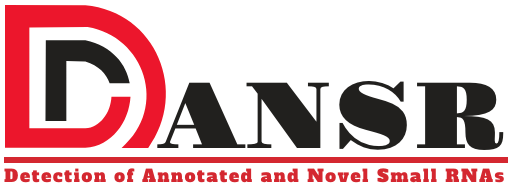

# DANSR: A tool for the detection of annotated and novel small RNAs

DANSR is a tool for the detection of annotated and novel small RNAs between 17-200nt from RNAseq data.  It has the ability to efficiently process large quantities of sequenced reads of variable length to identify diverse small RNA species.

##
DANSR is developed at [Christopher Maher Lab](http://www.maherlab.com/) at [Washington University in St. Louis](http://www.wustl.edu).

## Pipeline
### 1. Read Alignment 
In the first step, DANSR align read sequences to the reference human genome as well as a small noncoding library collected from different resources using BWA. If required, DANSR also runs cutadapt algorithm ot remove adapters from the read sequences. 

### 2. Cluster Identification (Read overlap)
To form clusters of reads, BAM files are first converted into BED format and overlapping alginments are merged into a read cluster using BEDTools. 

### 3. Boundary Optimization (Heuristic algorithm) 
To optimize boundary estimation between read clusters, DANSR employs a heuristic algorithm that assigns a weight to each read according to its overlap with other reads and calculates small noncoding RNA boundaries excluding the low-weight reads.

<div align="center">

</div>

### 4. Identify single-and multi-node clusters (Network model)
Next, since short reads with multiple hits are the primary source of false positives in small noncoding RNA discovery, DANSR uses a network model to identify all candidate single-node clusters and multi-node clusters.
<div align="center">

</div>

### 5. Identify annotated/unannotated small RNAs (Decision tree model)
Finally, a decision tree systematically filters read clusters that are likely to be false positive alignments generated from highly expressed small noncoding RNAs and sequencing errors. Based on the number of reads in a cluster, whether it is annotated, and whether the reads are repetitive, the model identifies and removes low-quality read clusters.

<div align="center">

</div>

The remaining read clusters are either assigned to annotated small noncoding RNAs or identified as novel RNAs based on their distance to the known RNAs and the Jaccard score of the set. 
   
## Manual
### Prerequisites
Please make sure you have installed the following tools:
- [Python3](https://www.python.org/)
  - [pandas](https://pandas.pydata.org/)
- [GCC](https://gcc.gnu.org/)
- [BWA](http://bio-bwa.sourceforge.net/)
- [samtools](https://github.com/samtools/samtools)
- [bedtools2](https://github.com/arq5x/bedtools2)
- [cutadapt](https://cutadapt.readthedocs.io/en/stable/) 

<!---
[CMake](https://cmake.org/) <br>
--->

### Installation
Clone this repository to the desired location:

```
git clone https://github.com/ChrisMaherLab/DANSR.git
```

Next, the file `DANSR/src/setup.small.ini` must be edited so that the second column contains the installation locations of BWA, bedtools and cutadapt.  If these executables are in your `PATH` variable, the command name alone will be sufficient; otherwise, the full path to the executable must be supplied.

As an optional step, you can add the absolute path to the "src" directory to your `PATH` variable.
 
Finally, DANSR makes use of human reference GRCh37 v75 GTF and FASTA files, which can be downloaded from Ensembl:
```
cd $PATH_TO_REFERENCE
wget ftp://ftp.ensembl.org/pub/release-75/gtf/homo_sapiens/Homo_sapiens.GRCh37.75.gtf.gz
wget ftp://ftp.ensembl.org/pub/release-75/fasta/homo_sapiens/dna/Homo_sapiens.GRCh37.75.dna.primary_assembly.fa.gz
gunzip *.gz
bwa index Homo_sapiens.GRCh37.75.dna.primary_assembly.fa
```

### Test installation
To test the installation, please type in your terminal the following command which shows the usage page of DANSR. 
```
$PATH_TO_DANSR/src/dansr.py -h
```

### Parameters
#### Input files
```
-i/--input-file    (Required) A FASTQ file of single-end RNA-seq reads if type is "single", or the first of two paired-end FASTQs if type is "pair"
-j/--input-file-2  (Required if pair) Second paired-end FASTQ file
-s/--single-type   (Default: forward) Strandedness of single reads, either "forward", "reverse" or "both"
-p/--pair-type     (Default: fr-unstranded) Strandedness of paired-end reads, either "fr-unstranded", "fr-firststranded" or "fr-secondstranded"
-r/--reference     (Required) Path to human reference genome in FASTA format
-c/--chromosomes   (Default: chr1-22,X) Comma separated list of chromosome names from reference to which reads will be aligned
-g/--gtf-small     (Required) A comma-separated list of paths to small RNA GTF files
-e/--small-types   (Optional) Comma separated list of additional gene_biotype entries from the small RNA GTF with which to annotate read clusters;
                    these types will be used in addition to the default biotypes: misc, piRNA, miRNA, rRNA, snRNA, snoRNA, tRNAs, Mt_rRNA, Mt_tRNA, misc_RNA, snRNA, siRNA, vaultRNA, hg19_F_misc, hg19_F_piRNA, hg19_miRNA, hg19_rRna, hg19_snRna, hg19_snoRna, hg19_tRNAs
-l/--list-of-gtf   (Required) A comma-separated list of paths to small RNA GTF files and the human reference GTF
-z/--setup-file    (Default: setup.small.ini) Path to the DANSR setup file if it has been moved from the default location
```
#### General options
```
-h/--help          (Optional) Print help information
-o/--output-dir    (Default: ./) Path to output directory
-S/--sample-name   (Default: sample) Sample name for output files
-k/--keep-tmp      (Optional) Do not delete the tmp folder when run is complete
-w/--skip          (Optional) Skip a step if target output exists
-v/--verbose       (Optional) Print details of run
```
#### Options for pipeline tools
```
-x/--cutadapter-opts  (Default: "") Command line options to be passed to cutadaptor enclosed with ""
-X/--bwa-options-aln  (Default: "-q 5 -l 17 -k 1") Command line options to be passed to bwa-aln enclosed with ""
-Y/--bwa-options-sam  (Default: "") Command line options to be passed to bwa-samse/sampe enclosed with ""
```
#### Input options
```
-b/--begin-no-trimming  (Optional) Do not trim input reads
-a/--adapter            (Required if -b not set) Adapter sequence to cut from first reads file
-A/--adapter2           (Required if paired and -b not set) 3' adapter sequence to cut from second reads file
```
#### Alignment or filtering options
```
-n/--number-hits      (Default: 5) Number of hits above which multi-mapped reads will be discarded
-N/--number-reads     (Default: 2) Minimum number of reads to form a cluster
-P/--percent-cur      (Default: 0.3) Max percentage of reads from precursor
-f/--cutoff           (Default: 0.33) RPM increase above which a cluster boundary will be designated
-U/--percent-uniq     (Default: 0.5) Minimum percentage of unique reads in a cluster
-R/--uniq-reads       (Default: 2) Minimum number of unique reads in a cluster
-V/--ov-with-largest  (Default: 0.75) Minimum percentage of overlap with largest cluster
-u/--unstranded       (Optional) Ignore strand when determining overlaps
-J/--jaccard-index    (Default: 0.3) Minimum Jaccard similarity score for a cluster
```
### Output
DANSR generates two main folders, one is for the alignment results and the other one is for the detection results. The main file in the alignment folder is the aligned BAM file. The detection results folder contains several files:
 
Main files:
1. ```annotated.smallRNAs.tsv```: contains all annotated small RNAs that pass all filters. 
2. ```annotated.smallRNAs.close.proximity.tsv```: contains all small RNAs that pass all filters and are in close proximity to annotated RNAs.
3. ```unannotated.smallRNAs.tsv```: contains all unannotated (novel) small RNAs that pass all filters. 

<u>Additional files:</u> 

4. ```all.clusters.tsv```: contains all clusters. 
5. ```annotated.rejected.tsv```: contains annotated small RNAs that didn't pass the filtering steps (e.g. overlapping with protein coding genes, small RNA not within the range of 17-200nt, small RNAs with low Jaccard score (not the best feature assigned)). 
6. ```unannotated.rejected.tsv```: contains unannotated small RNAs that did not pass the filters.

### Example
An example small RNA GTF and single read FASTQ file are included with DANSR to demonstrate how to run the tool.  It can be run as follows:

```
cd $PATH_TO_DANSR
gunzip example/*.gz
src/dansr.py \
        -i example/MRA2_miRNA.fastq \
        -o example \
	--type single \
	--begin-no-trimming \
	-v -N 10 \
        -r $PATH_TO_REFERENCE/Homo_sapiens.GRCh37.75.dna.primary_assembly.fa \
        -l example/smallRNA_library.gtf,$PATH_TO_REFERENCE/Homo_sapiens.GRCh37.75.gtf \
        -g example/smallRNA_library.gtf
```
The results of this execution can be compared with the results files in example/example_results.

## DANSR Docker Instructions
To use DANSR, a docker image has been created and tested on Linux and Mac. To run DANSR, you need to have [Docker](https://docs.docker.com/) installed on your machine. 

### Docker Installation
* Ubuntu: follow [the instructions](https://docs.docker.com/engine/installation/linux/docker-ce/ubuntu/) to get Docker CE for Ubuntu.
* Mac: follow [the instructions](https://store.docker.com/editions/community/docker-ce-desktop-mac) to install [the stable version of Docker CE](https://download.docker.com/mac/stable/Docker.dmg) on Mac.
<!--- 
* Windows: follow [the instructions](https://docs.docker.com/toolbox/toolbox_install_windows/) to install [Docker Toolbox](https://download.docker.com/win/stable/DockerToolbox.exe) on Windows. 
-->
 
To obtain the latest docker image, run the following on your command line:
 
```
docker pull chrismaherlab/dansr
```
To test the image, run the following command which shows the usage of this tool:
```
docker run chrismaherlab/dansr dansr -h
```
### Example 
To run DANSR using docker on the example data provided, use the following command:
```
docker run -v /local/folder:/dansr_data chrismaherlab/dansr dansr \
        --begin-no-trimming \
        -i /dansr_data/example/MRA2_miRNA.fastq \
        -o /dansr_data/example --type single --cutoff 0.33 \
	-v -w -N 10 -U 0.5 -R 2 -V 0.75 -J 0.3 \
        -r /dansr_data/PATH_TO_REFERENCE/Homo_sapiens.GRCh37.75.dna.primary_assembly.fa \
        -l /dansr_data/example/smallRNA_library.gtf,/dansr_data/PATH_TO_ANNOTATION/Homo_sapiens.GRCh37.75.gtf \
        -g /dansr_data/example/smallRNA_library.gtf
```
where ```/local/folder``` is the local directory on your machine that you need to map to a “location” within the Docker container. This directory should have all your data that you need to use with DANSR. 

